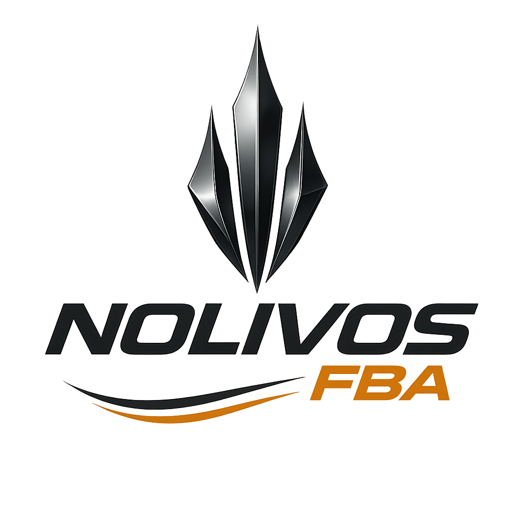

# ✅ LOGOS ACTUALIZADOS EN TODOS LOS TEMPLATES

**NOLIVOS FBA - Actualización completa de branding**

Fecha: 2024
Author: Hector Nolivos

---

## 📦 Archivos de Logo

Los logos están ubicados en: `/static/images/`

- **`logo.png`** (1.4 MB) - Logo para fondos claros
- **`logo-white.png`** (1.4 MB) - Logo para fondos oscuros

---

## ✅ Templates Actualizados

### 1. **opportunities.html** ✅
- **Cambio**: `💼 NOLIVOS FBA` → ``
- **Ubicación**: Sidebar izquierdo
- **Tamaño**: max-width: 180px

### 2. **trends.html** ✅
- **Cambio**: `💼 NOLIVOS FBA` → ``
- **Ubicación**: Sidebar izquierdo
- **Tamaño**: max-width: 180px

### 3. **alerts.html** ✅
- **Cambio**: `💼 NOLIVOS FBA` → ``
- **Ubicación**: Sidebar izquierdo
- **Tamaño**: max-width: 180px

### 4. **login.html** ✅
- **Cambio**: `<h1>🚀 NOLIVOS FBA</h1>` → ``
- **Ubicación**: Header central del formulario de login
- **Tamaño**: max-width: 220px
- **Nota**: Usa `logo.png` (no white) porque el fondo es claro

### 5. **loading.html** ✅
- **Cambio**: Agregado logo arriba de "🚀 Analizando Producto"
- **Ubicación**: Header de la página de carga
- **Tamaño**: max-width: 200px

### 6. **scanning.html** ✅
- **Cambio**: Agregado logo arriba de "⚡ Escaneo Ultra-Rápido"
- **Ubicación**: Header de la página de escaneo paralelo
- **Tamaño**: max-width: 200px

---

## 🎨 CSS Agregado

### Templates con Sidebar (opportunities, trends, alerts):

```css
.logo {
    margin-bottom: 3rem;
    text-align: center;
    padding-bottom: 1.5rem;
    border-bottom: 1px solid rgba(255, 255, 255, 0.1);
}

.logo img {
    max-width: 180px;
    height: auto;
}
```

### Template de Login:

```css
.logo img {
    max-width: 220px;
    height: auto;
    margin-bottom: 1rem;
}
```

### Templates de Loading/Scanning:

```css
.header img {
    max-width: 200px;
    height: auto;
    margin-bottom: 1.5rem;
}

/* o */

.loading-header img {
    max-width: 200px;
    height: auto;
    margin-bottom: 1.5rem;
}
```

---

## 📋 Resumen de Cambios

| Template | Emoji Anterior | Logo Nuevo | Fondo |
|---|---|---|---|
| opportunities.html | 💼 NOLIVOS FBA | logo-white.png | Oscuro |
| trends.html | 💼 NOLIVOS FBA | logo-white.png | Oscuro |
| alerts.html | 💼 NOLIVOS FBA | logo-white.png | Oscuro |
| login.html | 🚀 NOLIVOS FBA | logo.png | Claro |
| loading.html | (ninguno) | logo-white.png | Oscuro |
| scanning.html | (ninguno) | logo-white.png | Oscuro |

**Total templates actualizados**: 6

---

## 🔧 Configuración de Flask

Para que los logos se sirvan correctamente, Flask debe tener configurado el folder estático:

```python
app = Flask(__name__)
# Flask automáticamente sirve /static/* desde la carpeta "static/"
```

Las imágenes se acceden vía:
- `http://localhost:4994/static/images/logo.png`
- `http://localhost:4994/static/images/logo-white.png`

---

## ✨ Cómo se Ve Ahora

### Antes:
```html
<div class="logo">
    💼 NOLIVOS FBA
</div>
```

### Ahora:
```html
<div class="logo">
    
</div>
```

---

## 🎯 Próximos Pasos (Opcional)

1. **Favicon**: Agregar favicon.ico en `/static/`
2. **Logo pequeño**: Crear versión más pequeña para mobile
3. **SVG version**: Convertir a SVG para mejor escalado
4. **Lazy loading**: Agregar `loading="lazy"` para performance
5. **Responsive**: Ajustar tamaños en media queries mobile

---

## 📱 Responsive Design

Los logos son responsive gracias a:
```css
img {
    max-width: XXXpx;  /* Límite máximo */
    height: auto;       /* Mantiene aspect ratio */
}
```

En pantallas pequeñas, el logo se ajusta automáticamente sin distorsión.

---

## 🧪 Testing

Para verificar que los logos se ven correctamente:

1. **Iniciar Flask**:
   ```bash
   python app.py
   ```

2. **Visitar páginas**:
   - http://localhost:4994/login → Logo claro (logo.png)
   - http://localhost:4994/opportunities → Logo blanco (logo-white.png)
   - http://localhost:4994/trends → Logo blanco
   - http://localhost:4994/scan-products → Logo blanco
   - (Analizar un producto para ver loading.html)

3. **Verificar en DevTools**:
   - Abrir Chrome DevTools (F12)
   - Network tab → ver que `logo.png` y `logo-white.png` cargan correctamente
   - Status: 200 OK

---

## 🚨 Troubleshooting

### Los logos no aparecen:

**Causa 1**: Flask no está sirviendo archivos estáticos
```python
# Verificar que Flask tenga:
app = Flask(__name__)
# (Ya viene configurado por defecto)
```

**Causa 2**: Ruta incorrecta
```html
<!-- ✅ CORRECTO -->


<!-- ❌ INCORRECTO -->
      <!-- Falta / inicial -->
            <!-- Falta /static -->
```

**Causa 3**: Archivos no existen
```bash
# Verificar que existan:
ls -la static/images/logo*.png
```

**Causa 4**: Cache del navegador
```
Ctrl + Shift + R  (Windows/Linux)
Cmd + Shift + R   (Mac)
```

---

## 📊 Estadísticas de Archivos

```bash
$ ls -lh static/images/logo*.png
-rwxrwxrwx 1 hector hector 1.4M  logo-white.png
-rwxrwxrwx 1 hector hector 1.4M  logo.png
```

**Tamaño total**: ~2.8 MB para ambos logos

**Recomendación**: Optimizar imágenes para web:
- Usar TinyPNG / ImageOptim
- Target: < 200 KB por imagen
- Mantener calidad visual

---

## 👨‍💻 Autor

**Hector Nolivos**
📧 hector@nolivos.cloud
🌐 https://nolivos.cloud
🏢 Nolivos Law & Technology

---

**© 2024 Hector Nolivos. Todos los derechos reservados.**
**NOLIVOS FBA - Sistema profesional de análisis FBA**
